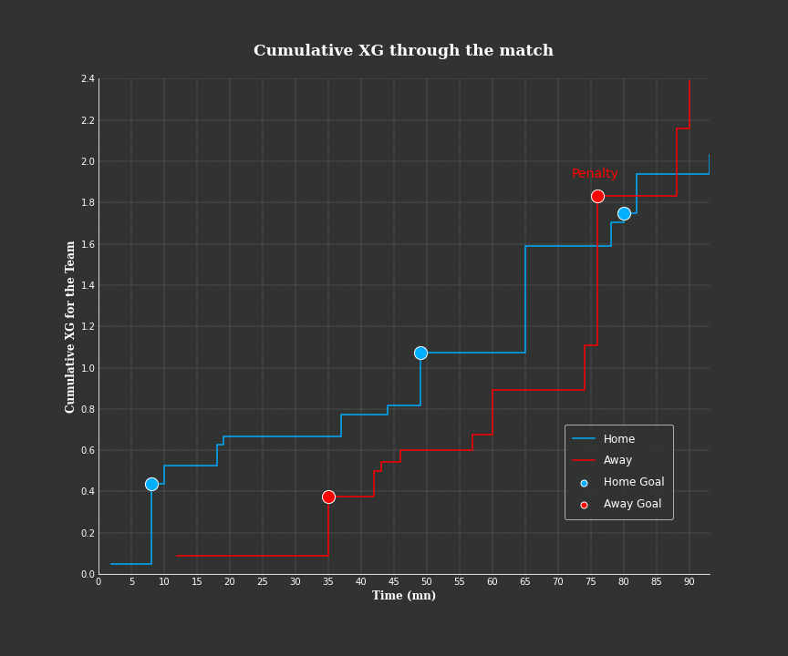

# Expected Goals model

Author : Chloe Gobé

Expected Goals (XG) is a metric used more and more frequently to describe the probability of a shot being turned into a goal under different configurations. It allows to describe the course of a match by looking at the shooting opportunities.

This repository is built in two steps: 

1. The construction of a ML model allowing to compute the probability of scoring by shooting on goal.
2. The use of this model to analyse a match.

Many thanks to Friends of Tracking for the resources provided.

## About the data used

- For the first step, I was provided with a dataset containing descriptions of shots that I do not own and is therefore not available here.
- For the second step, I used the data from the Metrica match 2 available here https://github.com/metrica-sports/sample-data

## The output of the analysis

- XG for the game 2 : 

- Cumutative XG during the game 2 : 

